# Práctica 2 — La misma máquina, en código

Computación en la Nube · Universidad Francisco de Paula Santander
Infraestructura de la Práctica 1 (una máquina `e2-micro` con nginx y una regla de cortafuegos) declarada, planeada, aplicada, destruida y reconstruida con Terraform, con el estado en un bucket de Cloud Storage.

## Qué se construyó

Lo que quedó existiendo al final de la fase 6: la máquina `web-tf`, la regla `permitir-http`, la IP externa efímera que expone el puerto 80, el bucket `tfstate-nube-2026-ii` con el estado de Terraform, y el repositorio de GitHub con el código que describe todo lo anterior.

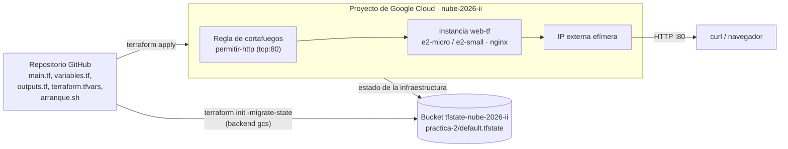

## Evidencias

### Fase 1 — Declarar y aplicar por primera vez

Plan: se propone crear los dos recursos declarados en `main.tf` (la regla de cortafuegos y la instancia). Terraform no encuentra nada existente con esos nombres, así que no hay actualizaciones ni destrucciones, solo altas.

```
Plan: 2 to add, 0 to change, 0 to destroy.

Do you want to perform these actions?
  Terraform will perform the actions described above.
  Only 'yes' will be accepted to approve.

  Enter a value: yes

google_compute_firewall.permitir_http: Creating...
google_compute_instance.web: Creating...
google_compute_firewall.permitir_http: Still creating... [00m10s elapsed]
google_compute_instance.web: Still creating... [00m10s elapsed]
google_compute_firewall.permitir_http: Creation complete after 12s [id=projects/nube-2026-ii/global/firewalls/permitir-http]
google_compute_instance.web: Still creating... [00m20s elapsed]
google_compute_instance.web: Still creating... [00m30s elapsed]
google_compute_instance.web: Creation complete after 31s [id=projects/nube-2026-ii/zones/us-central1-a/instances/web-tf]

Apply complete! Resources: 2 added, 0 changed, 0 destroyed.
```

`git status` antes del primer commit del código (el `.terraform.lock.hcl` queda como no rastreado, tal como se espera):

```
carlosantonioav@cloudshell:~/practica2_nube (nube-2026-ii)$ git status
On branch main
Your branch is up to date with 'origin/main'.

Untracked files:
  (use "git add <file>..." to include in what will be committed)
        .terraform.lock.hcl

nothing added to commit but untracked files present (use "git add" to track)
```

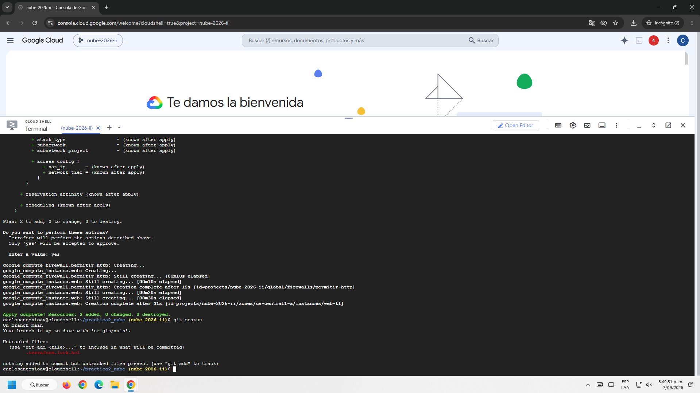

Commit de esta fase: `Máquina y regla de cortafuegos en Terraform`.

### Fase 2 — Salida con la IP y verificación de la página propia

```
carlosantonioav@cloudshell:~/practica2_nube (nube-2026-ii)$ terraform output ip_externa
"34.58.53.193"
carlosantonioav@cloudshell:~/practica2_nube (nube-2026-ii)$ curl -m 8 http://$(terraform output -raw ip_externa)
<h1><HOLA MUNDO DICEN CAR Y JD></h1><p>Servida desde Terraform por web-tf</p>
```

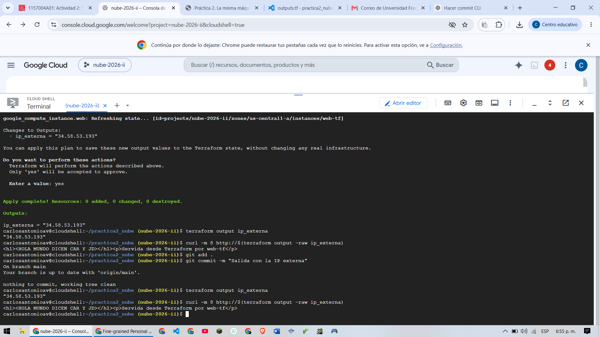
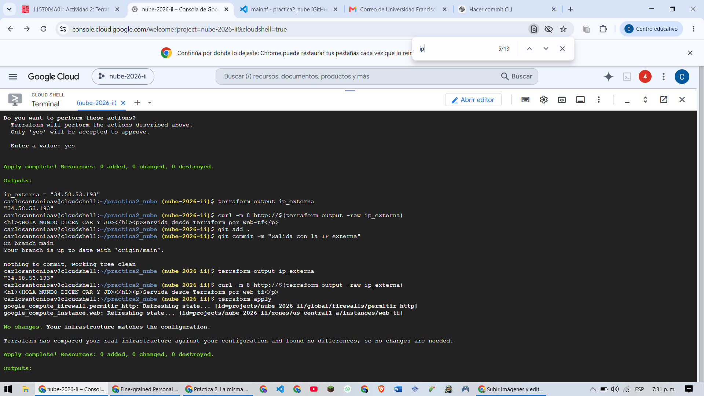

Commit de esta fase: `Salida con la IP externa` (con `outputs.tf`).

### Fase 3 — Idempotencia y deriva

Tres salidas seguidas, como pide la guía:

**1. Idempotencia** — ejecutar `apply` otra vez sin cambiar nada:

```
carlosantonioav@cloudshell:~/practica2_nube (nube-2026-ii)$ terraform apply
google_compute_firewall.permitir_http: Refreshing state...
google_compute_instance.web: Refreshing state...

No changes. Your infrastructure matches the configuration.

Apply complete! Resources: 0 added, 0 changed, 0 destroyed.
```

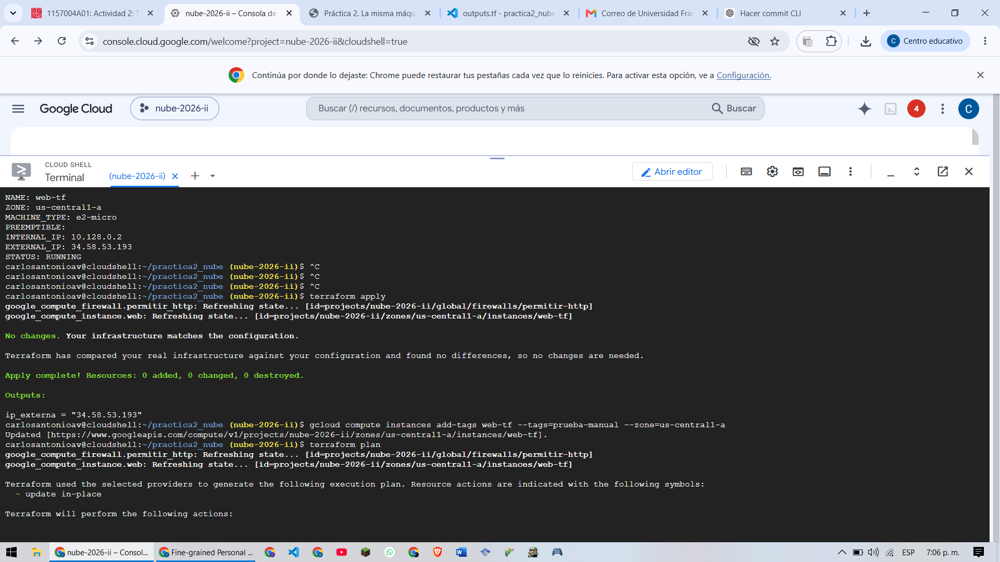

**2. Deriva** — se agrega a mano una etiqueta que el código no declara, y `terraform plan` la detecta:

```
carlosantonioav@cloudshell:~/practica2_nube (nube-2026-ii)$ gcloud compute instances add-tags web-tf --tags=prueba-manual --zone=us-central1-a
Updated [https://www.googleapis.com/compute/v1/projects/nube-2026-ii/zones/us-central1-a/instances/web-tf].
carlosantonioav@cloudshell:~/practica2_nube (nube-2026-ii)$ terraform plan
...
  # google_compute_instance.web will be updated in-place
  ~ resource "google_compute_instance" "web" {
        id                        = "projects/nube-2026-ii/zones/us-central1-a/instances/web-tf"
        name                      = "web-tf"
      ~ tags                      = [
          - "prueba-manual",
            "servidor-web",
        ]
        # (25 unchanged attributes hidden)
        # (4 unchanged blocks hidden)
    }

Plan: 0 to add, 1 to change, 0 to destroy.
```

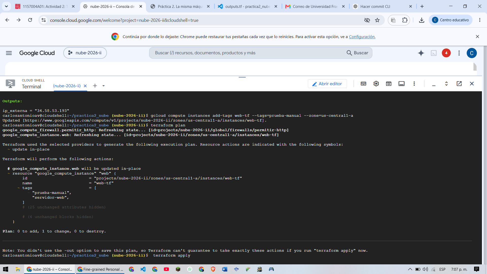

**3. `describe` final** — tras aceptar el `apply`, la etiqueta manual ya no está:

```
carlosantonioav@cloudshell:~/practica2_nube (nube-2026-ii)$ gcloud compute instances describe web-tf --format="value(tags.items)"
No zone specified. Using zone [us-central1-a] for instance: [web-tf].
servidor-web
```

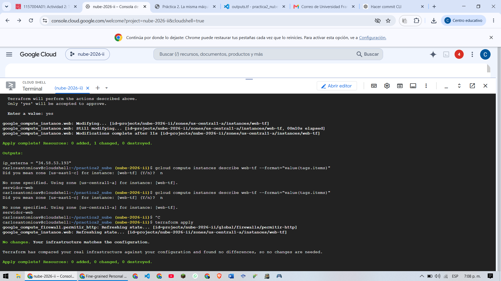

### Fase 4 — Variables y cambio de tipo de máquina

Error del primer intento, antes de autorizar el apagado:

```
carlosantonioav@cloudshell:~/practica2_nube (nube-2026-ii)$ terraform apply -var tipo_maquina=e2-small
...
Plan: 0 to add, 1 to change, 0 to destroy.

  Enter a value: yes

google_compute_instance.web: Modifying...

Error: Changing the machine_type, min_cpu_platform, service_account, enable_display, shielded_instance_config,
scheduling.node_affinities, scheduling.max_run_duration or network_interface.[#d].(network/subnetwork/subnetwork_project)
or advanced_machine_features on a started instance requires stopping it. To acknowledge this, please set
allow_stopping_for_update = true in your config. You can also stop it by setting desired status = "TERMINATED",
but the instance will not be restarted after the update.
```

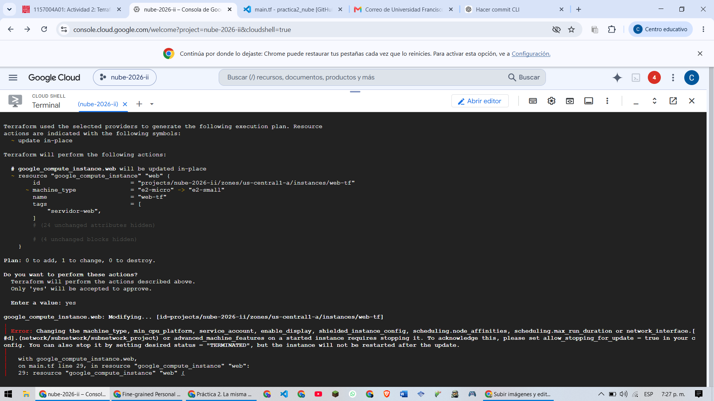

Tras agregar `allow_stopping_for_update = true` al recurso, el segundo intento sí completa:

```
Plan: 0 to add, 1 to change, 0 to destroy.

  Enter a value: yes

google_compute_instance.web: Modifying...
google_compute_instance.web: Still modifying... [00m10s elapsed]
google_compute_instance.web: Still modifying... [00m20s elapsed]
google_compute_instance.web: Still modifying... [00m30s elapsed]
google_compute_instance.web: Still modifying... [00m40s elapsed]
google_compute_instance.web: Modifications complete after 44s

Apply complete! Resources: 0 added, 1 changed, 0 destroyed.

Outputs:

ip_externa = "34.58.53.193"
```

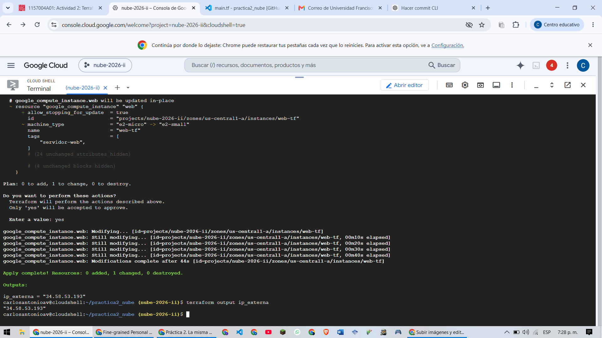

Las dos IPs, una junto a la otra: la de la evidencia 2 fue `34.58.53.193`, y la de después del cambio de tipo también fue `34.58.53.193`. En este caso la IP efímera no cambió al apagar y volver a encender la máquina; nada en el código la fijó (no hay una `google_compute_address` reservada), así que esa coincidencia no está garantizada para una próxima ejecución.

Commit de esta fase: `Variables y autorización para apagar la máquina` / `allow_stopping_for_update = true`.

### Fase 5 — Destruir y volver a crear, cronometrado

```
carlosantonioav@cloudshell:~/practica2_nube (nube-2026-ii)$ time terraform destroy -auto-approve
...
Destroy complete! Resources: 2 destroyed.

real    0m25.591s
user    0m3.321s
sys     0m0.735s
```

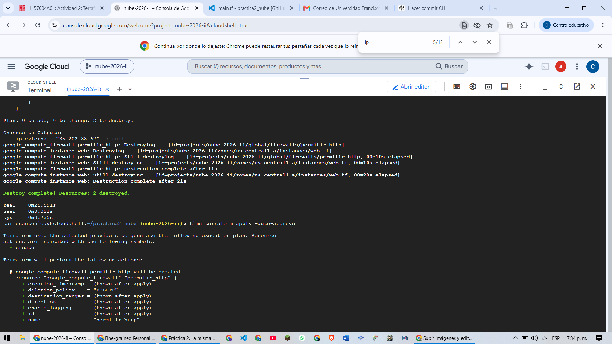

```
carlosantonioav@cloudshell:~/practica2_nube (nube-2026-ii)$ time terraform apply -auto-approve
...
Apply complete! Resources: 2 added, 0 changed, 0 destroyed.

Outputs:

ip_externa = "35.202.88.67"

real    0m19.905s
user    0m2.873s
sys     0m0.584s
```

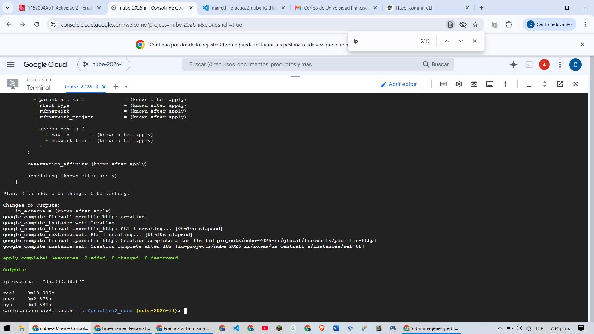

Tabla de tiempos (empezada en la Práctica 1):

| Cómo | Tiempo | Qué queda después |
|---|---|---|
| Interfaz gráfica (Práctica 1, fase 1) | ~2 minutos | Nada. Ni siquiera la lista de clics. |
| `gcloud` (Práctica 1, fase 5) | ≈ 16,177 s | Un comando en el historial, si no se borra. |
| Terraform (hoy) | destroy: 25,591 s · apply: 19,905 s | Un repositorio que cualquiera puede clonar, leer y volver a ejecutar, con el historial de cómo llegó a ser lo que es. |

### Fase 6 — Estado remoto

Migración del backend local al bucket, y comprobación de que el plan no propone cambios después de borrar el estado local:

```
carlosantonioav@cloudshell:~/practica2_nube (nube-2026-ii)$ terraform init -migrate-state
...
Do you want to copy the state from "local" to "gcs"? Terraform can migrate the state...
  Enter a value: yes

Successfully configured the backend "gcs"! Terraform will automatically use this backend unless the backend configuration changes.
Terraform has been successfully initialized!

carlosantonioav@cloudshell:~/practica2_nube (nube-2026-ii)$ terraform state list
google_compute_firewall.permitir_http
google_compute_instance.web

carlosantonioav@cloudshell:~/practica2_nube (nube-2026-ii)$ gcloud storage ls gs://tfstate-nube-2026-ii/practica-2/
gs://tfstate-nube-2026-ii/practica-2/default.tfstate

carlosantonioav@cloudshell:~/practica2_nube (nube-2026-ii)$ rm terraform.tfstate terraform.tfstate.backup
carlosantonioav@cloudshell:~/practica2_nube (nube-2026-ii)$ terraform plan
google_compute_firewall.permitir_http: Refreshing state...
google_compute_instance.web: Refreshing state...

No changes. Your infrastructure matches the configuration.
```

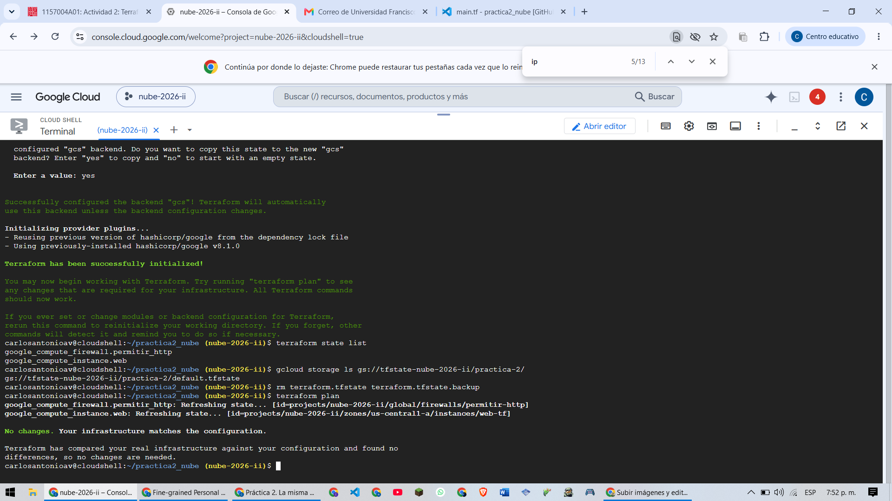

Commit de esta fase: `Estado en Cloud Storage`.

### Fase 7 — Todo destruido y proyecto vacío

```
carlosantonioav@cloudshell:~/practica2_nube (nube-2026-ii)$ terraform state list
carlosantonioav@cloudshell:~/practica2_nube (nube-2026-ii)$ gcloud compute instances list
Listed 0 items.
carlosantonioav@cloudshell:~/practica2_nube (nube-2026-ii)$ gcloud compute disks list
Listed 0 items.
carlosantonioav@cloudshell:~/practica2_nube (nube-2026-ii)$ gcloud compute addresses list
Listed 0 items.
carlosantonioav@cloudshell:~/practica2_nube (nube-2026-ii)$ gcloud compute firewall-rules list --filter="name=permitir-http"
```

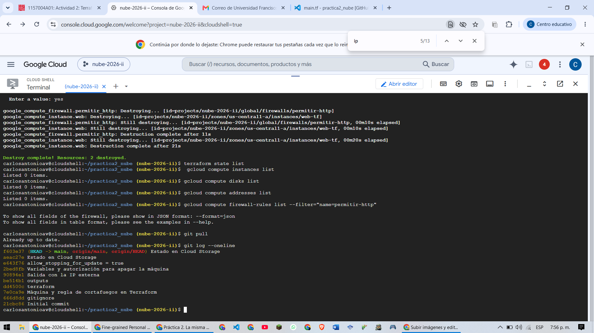

Historial de commits, uno por fase:

```
f603e37 Estado en Cloud Storage
aeac27e Estado en Cloud Storage
e643f76 allow_stopping_for_update = true
2bed8fb Variables y autorización para apagar la máquina
90894e1 Salida con la IP externa
be514b1 outputs
dd4500c terraform
7e0ca9e Máquina y regla de cortafuegos en Terraform
666d8dd gitignore
21cbc86 Initial commit
```

Informe de facturación del día (el único gasto proviene de Networking, `$1,208`, cubierto en su totalidad por otros ahorros; el subtotal del día quedó en `$0`):

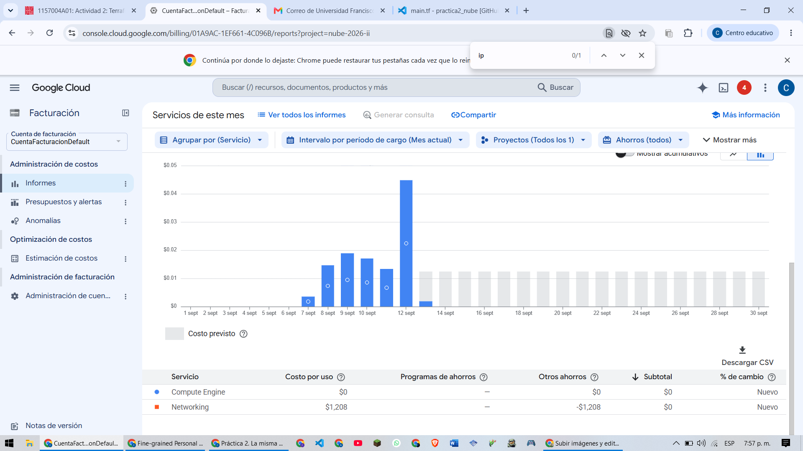

## Preguntas

**1. Si en lugar de una etiqueta se hubiera creado a mano una máquina nueva, `web-manual`, ¿qué habría propuesto `terraform plan`? ¿Y qué habría hecho `terraform destroy` con ella?**

`terraform plan` no la habría mencionado en absoluto. Terraform no examina el proyecto completo buscando recursos "de más"; compara únicamente lo que está escrito en el código contra lo que él mismo anotó en su archivo de estado la última vez que actuó. Como `web-manual` nunca pasó por un `apply`, no existe ni en `main.tf` ni en el `.tfstate`, así que es invisible para el plan: seguiría mostrando `No changes` (o solo los cambios de los recursos que sí están declarados), sin ninguna línea sobre esa máquina. Por la misma razón, `terraform destroy` tampoco la tocaría: destroy borra exclusivamente lo que aparece en el estado, y `web-manual` no aparece ahí. Quedaría corriendo y consumiendo cuota después del destroy, exactamente igual que el bucket, pero sin ninguna intención detrás: mientras el bucket se dejó vivo a propósito, `web-manual` quedaría viva por descuido, porque el estado —no la consola, no el código fuente por sí solo— es lo único que le dice a Terraform qué existe.

**2. El bucket del estado se creó con `gcloud` y no en `main.tf`. ¿Cuál es el problema? ¿Qué pasaría si el bucket sí estuviera declarado ahí el día que alguien ejecute `terraform destroy`?**

El problema es una dependencia circular: para que Terraform pudiera crear el bucket como un recurso más, necesitaría ya tener configurado un backend remoto —el propio bucket— donde guardar el estado de esa misma operación de creación. La primera vez que se ejecuta, ese bucket todavía no existe, así que no hay dónde guardar el estado de "voy a crear el bucket". Por eso se crea aparte, a mano, una única vez, y `main.tf` solo lo referencia como destino del estado (`backend "gcs" { bucket = ... }`), nunca como un `resource` administrado.

Si a pesar de eso alguien lo declarara como `resource "google_storage_bucket"` dentro del mismo `main.tf` que lo usa como backend, el día que se ejecute `terraform destroy`, Terraform lo destruiría igual que cualquier otro recurso presente en el estado, incluyendo el archivo que en ese preciso momento contiene el estado de la operación de destrucción que se está ejecutando. Es decir, se borraría el bucket mientras Terraform todavía necesita leerlo y escribirlo para terminar de registrar qué se destruyó, dejando el proceso a medias y sin ningún lugar donde quedara anotado el resultado final.

**3. Con los precios de lista de la calculadora de Google Cloud: ¿cuánto costaría un mes con la infraestructura de la fase 6 encendida? ¿Cuánto costó tenerla encendida durante la práctica? ¿Qué recurso sigue costando después del `destroy`, cuánto, y por qué se decidió conservarlo?**

Con los precios de lista de `us-central1`, una `e2-micro` encendida el mes completo cuesta alrededor de **US$6,11/mes** y una `e2-small` alrededor de **US$12,23/mes**; la regla de cortafuegos no tiene costo propio. En este proyecto, sin embargo, la `e2-micro` cae dentro del nivel *Siempre gratis* de Google Cloud (una VM `e2-micro` no interrumpible al mes en `us-central1`, `us-west1` o `us-east1`, más 1 GB de salida de red desde Norteamérica), así que el costo esperado de tenerla encendida un mes completo en ese nivel es **US$0**, mientras no se supere ese límite.

Eso coincide con lo que muestra el informe de facturación del día: el costo por uso de **Compute Engine fue $0**, y el de **Networking fue $1,208**, compensado en su totalidad por "Otros ahorros" (-$1,208), dejando el **subtotal del día en $0**. Es decir, tener la infraestructura encendida durante la práctica no generó cargo real gracias al nivel gratuito.

El único recurso que sigue existiendo —y costando, aunque sea una fracción de centavo— después del `destroy` es el **bucket `tfstate-nube-2026-ii`**, con almacenamiento estándar en `us-central1` a US$0,020 por GB al mes: como el archivo de estado pesa unos pocos kilobytes, su costo mensual real es prácticamente cero, muy por debajo de un centavo. Se decidió conservarlo porque es la única fuente de verdad que conecta el código con los recursos reales que alguna vez existieron; borrarlo no ahorra nada perceptible y, en cambio, dejaría a Terraform sin forma de saber qué había que destruir la próxima vez.

_Nota: estas cifras usan precios públicos de lista para `us-central1`; para la entrega final conviene confirmarlas con una corrida propia en la [calculadora de precios de Google Cloud](https://cloud.google.com/products/calculator)._
